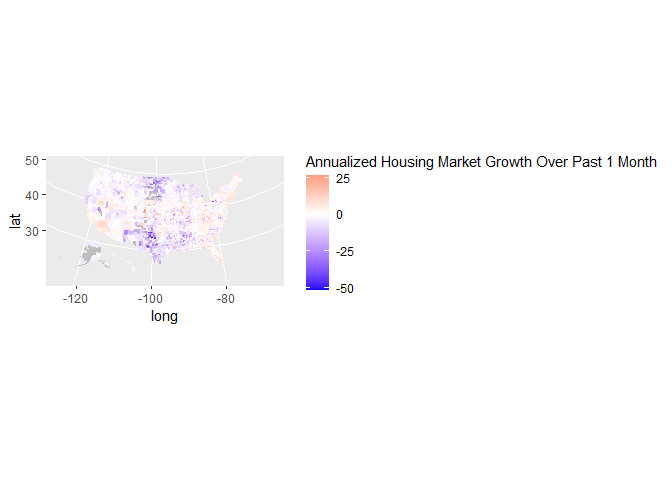
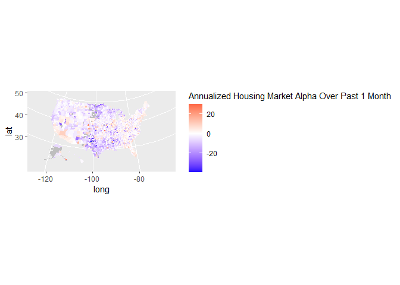
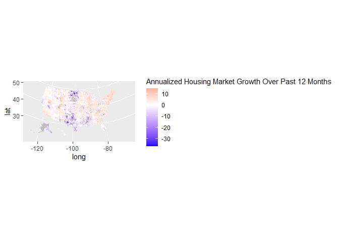
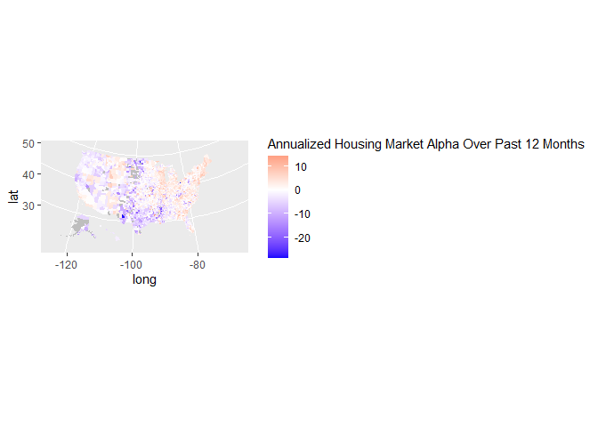
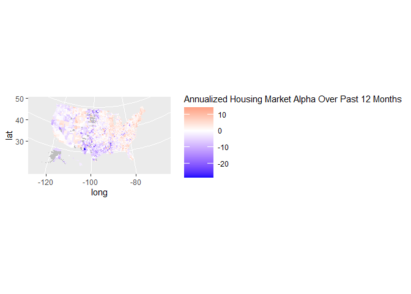
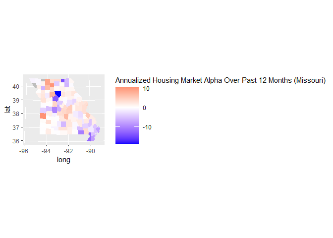
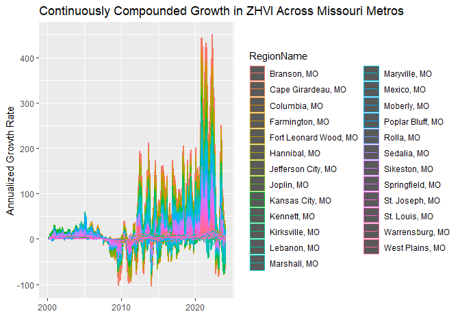
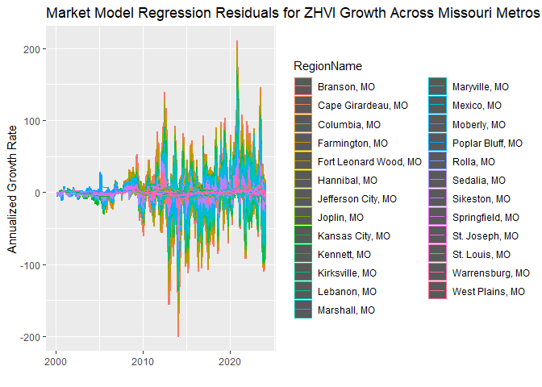
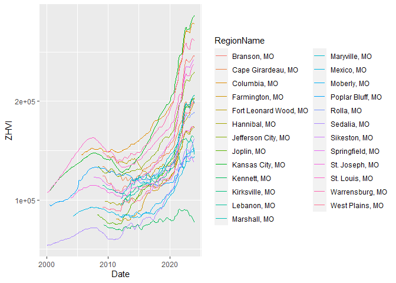
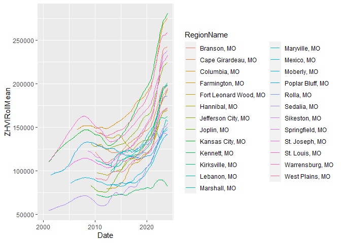

Zillow House Value Index Comparisons
================

## Overview

In this project, we will import data from
[Zillow](https://www.zillow.com/research/data/) to analyze patterns in
residential real estate values across various geographies. The Zillow
Home Value Index (ZHVI) is one example of a housing price index (HPI),
which tracks relative price changes in residential real estate over time
across varying geographies and frequencies. There are many different
ways to derive such HPIs from real estate transaction data. For example,
a simple approach is to just use the median home sale in a particular
region over a particular time period. However, typically one would want
to at least use a “repeat sales” methodology, where housing returns are
estimated from properties that sell multiple times over the data
lifespan. In other words, properties with only one sale do not have
sufficient information to tell us anything about how prices are changing
over time. Some HPIs have an arbitrary starting value (typically
normalized to equal 100 on a particular date), and then show how that
value would compound as time moves on. The HPIs published by the Federal
Housing Finance Agency ([FHFA
HPIS](https://www.fhfa.gov/DataTools/Downloads/Pages/House-Price-Index-Datasets.aspx))
are formatted that way. However, since the ZHVI more precisely aims to
capture the “typical” home value for a region during each time period,
the units have a bit more interpretable value. Although, in either case,
it is more statistically appropriate to make comparisons of housing
returns, rather than property values or HPI levels.

## R Packages

- The [devtools package](https://cran.r-project.org/package=devtools)
  contains the `install_github()` function, which will allow us to
  install the urbnmapr package from GitHub.
- The [urbnmapr
  package](https://urban-institute.medium.com/how-to-create-state-and-county-maps-easily-in-r-577d29300bb2)
  has mapping data for various geographies.
- The [readr package](https://cran.r-project.org/package=readr) is a
  common package for reading in data files. After installing, the
  RStudio Environment tab will have a new option to import data sets
  that uses this package. It will even generate the R code for you to
  copy and paste into your script.
- The [tidyr package](https://cran.r-project.org/package=tidyr) has
  tools for transforming the data.
- The [ggplot2 package](https://cran.r-project.org/package=ggplot2) for
  graphics and visuals.
- The [xts package](https://cran.r-project.org/package=xts) is short for
  ‘eXtensible Time Series’, which contains tools for working with time
  series data.

``` r
# Create list of packages needed for this exercise
list.of.packages = c("devtools","readr","tidyr","ggplot2","xts","rmarkdown")
# Check if any have not yet been installed
new.packages = list.of.packages[!(list.of.packages %in% installed.packages()[,"Package"])]
# If any need to be installed, install them
if(length(new.packages)) install.packages(new.packages)
# Urban Institute Mapping package downloaded via GitHub using devtools
library(devtools)
```

    ## Loading required package: usethis

``` r
install_github("UrbanInstitute/urbnmapr")
```

    ## Skipping install of 'urbnmapr' from a github remote, the SHA1 (ef9f4488) has not changed since last install.
    ##   Use `force = TRUE` to force installation

``` r
# Load in the packages
library(readr)
library(tidyr)
library(ggplot2)
library(xts)
```

    ## Loading required package: zoo

    ## 
    ## Attaching package: 'zoo'

    ## The following objects are masked from 'package:base':
    ## 
    ##     as.Date, as.Date.numeric

``` r
library(urbnmapr)
```

## Data Download and Cleaning

If you go to the Zillow Research webpage (linked at beginning of
Overview), there are a couple dropdown boxes to select different
“flavors” of the data. The first option (Data Type) allows you to
deviate from the “flagship” ZHVI, which is the all-homes, middle-tier,
smoothed, and seasonally-adjusted cut. Other options include filters for
different tiers (top or bottom), property types (single-family or
condo/co-op), or number of bedrooms. The second dropdown lets you refine
the geography level that can range from a national estimate down to the
neighborhood level. Although the data downloads provide a monthly time
series, it is important to note that finer geography levels (such as
neighborhoods) have less data within a given month, and may even have
missing values if no residential properties sold in the neighborhood
during the particular month. Thus, there are tradeoffs to consider
between data frequency and geography level when planning further
analysis.

### State-level ZHVI Data

For this analysis, we’ll stick to the flagship ZHVI data type. Then to
start, we’ll begin with the state level data before diving into the
finer geography levels. To find the url components in the chunk below,
you can use the “Copy link address” tool in your browser after
right-clicking on the “Download” button from the webpage. Below, I’ve
partitioned this url into a “base” component (common to all flavors of
the data) and an “endpoint” component (`STATESurl` adds the endpoint,
which is specific to the particular flavor of the data).

``` r
urlbase = "https://files.zillowstatic.com/research/public_csvs/zhvi/"
STATESurl = paste(urlbase,"State_zhvi_uc_sfrcondo_tier_0.33_0.67_sm_sa_month.csv", sep="")
STATESurl
```

    ## [1] "https://files.zillowstatic.com/research/public_csvs/zhvi/State_zhvi_uc_sfrcondo_tier_0.33_0.67_sm_sa_month.csv"

Now let’s use `readr()` to import the csv located at that above url, and
then let’s display the first few rows with `head()`.

``` r
STATESraw = read_csv(STATESurl, show_col_types=FALSE)
head(STATESraw)
```

    ## # A tibble: 6 × 293
    ##   RegionID SizeRank RegionName   RegionType StateName `2000-01-31` `2000-02-29`
    ##      <dbl>    <dbl> <chr>        <chr>      <lgl>            <dbl>        <dbl>
    ## 1        9        0 California   state      NA             184934.      185556.
    ## 2       54        1 Texas        state      NA             108652.      108711.
    ## 3       14        2 Florida      state      NA             105563.      105792.
    ## 4       43        3 New York     state      NA             151333.      151872.
    ## 5       47        4 Pennsylvania state      NA              96294.       96500.
    ## 6       21        5 Illinois     state      NA             123438.      123537.
    ## # ℹ 286 more variables: `2000-03-31` <dbl>, `2000-04-30` <dbl>,
    ## #   `2000-05-31` <dbl>, `2000-06-30` <dbl>, `2000-07-31` <dbl>,
    ## #   `2000-08-31` <dbl>, `2000-09-30` <dbl>, `2000-10-31` <dbl>,
    ## #   `2000-11-30` <dbl>, `2000-12-31` <dbl>, `2001-01-31` <dbl>,
    ## #   `2001-02-28` <dbl>, `2001-03-31` <dbl>, `2001-04-30` <dbl>,
    ## #   `2001-05-31` <dbl>, `2001-06-30` <dbl>, `2001-07-31` <dbl>,
    ## #   `2001-08-31` <dbl>, `2001-09-30` <dbl>, `2001-10-31` <dbl>, …

If we explore the table above, we can start to interpret the structure
of the data provided and clean it up. The first observation of note is
that we have a “panel” of data, which means that there are two relevant
dimensions of variation here: location (spatial) and time (temporal).
Another immediate observation about the data is that the StateName
variable is entirely empty (RegionName contains the text state names).
So our first cleaning step will be to just delete that column from the
data frame. Next, we’ll transform our data from a “wide” format to a
“long” format. The original “wide” format is when the two table
dimensions (rows and columns, or observations and variables) are
representing the two dimensions of variation in 2-D data. The “long”
format transforms the time dimension from being separate columns into a
single column, which also elongates the table to where each row is now a
state-month observation where each state has many rows corresponding
with the time series. This expands our 50-row, 284-column data frame
into a 14208-row, 7 column data frame. *Note: this “long” format is
particularly useful whenever expanding beyond two dimensions. For
example, consider replacing the one spatial dimension, state, with two
spatial dimensions, latitude and longitude. Then our data would expand
out to three dimensions. Considering that lots of meaningful statistical
analysis in economics and finance is multi-dimensional, this is often
the best structure to adopt.*

``` r
# Remove empty variable, StateName
STATESraw = STATESraw[,!(names(STATESraw)=="StateName")]
# Expand data frame to long format
STATESlong = pivot_longer(STATESraw,
                          cols=5:ncol(STATESraw),
                          names_to="Date",
                          values_to="ZHVI")
# Reformat date to a date format
STATESlong$Date = as.Date(STATESlong$Date)
# Reformat state name variable, RegionName, into categorical array
STATESlong$RegionName = as.factor(STATESlong$RegionName)
```

Now that we have the state-level data all cleaned up, the next steps on
this analysis will require the use of the National ZHVI values. These
are included with the Metro-level data. So we’ll first download the data
for a couple other geography levels to analyze and compare. If you run
into any computational limitations, you can stick to just the
state/metro level analysis and only run those code chunks. The finer
geographies can take some time to clean and analyze if you have an older
computer.

### Metro-level ZHVI Data

The default geography on the webpage is for all U.S. Metros, which also
comes with a national ZHVI time series. This includes most U.S.
metropolitan and micropolitan statistical areas (MSAs, for short).
Although it is the
[Census](https://www.census.gov/programs-surveys/metro-micro/about.html)
who define these terms and indicate that there are 927 total MSAs, the
ZHVI data provides fairly good coverage of nearly 900 MSAs, 896 as of
June 2023. This corresponds with more than 250,000 MSA-month
observations.

``` r
METROSurl = paste(urlbase,"Metro_zhvi_uc_sfrcondo_tier_0.33_0.67_sm_sa_month.csv", sep="")
METROSraw = read_csv(METROSurl, show_col_types=FALSE)
nrow(METROSraw)
```

    ## [1] 895

``` r
head(METROSraw)
```

    ## # A tibble: 6 × 293
    ##   RegionID SizeRank RegionName    RegionType StateName `2000-01-31` `2000-02-29`
    ##      <dbl>    <dbl> <chr>         <chr>      <chr>            <dbl>        <dbl>
    ## 1   102001        0 United States country    <NA>           118707.      118916.
    ## 2   394913        1 New York, NY  msa        NY             214712.      215624.
    ## 3   753899        2 Los Angeles,… msa        CA             216061.      216865.
    ## 4   394463        3 Chicago, IL   msa        IL             148347.      148484.
    ## 5   394514        4 Dallas, TX    msa        TX             123115.      123170.
    ## 6   394692        5 Houston, TX   msa        TX             119314.      119336.
    ## # ℹ 286 more variables: `2000-03-31` <dbl>, `2000-04-30` <dbl>,
    ## #   `2000-05-31` <dbl>, `2000-06-30` <dbl>, `2000-07-31` <dbl>,
    ## #   `2000-08-31` <dbl>, `2000-09-30` <dbl>, `2000-10-31` <dbl>,
    ## #   `2000-11-30` <dbl>, `2000-12-31` <dbl>, `2001-01-31` <dbl>,
    ## #   `2001-02-28` <dbl>, `2001-03-31` <dbl>, `2001-04-30` <dbl>,
    ## #   `2001-05-31` <dbl>, `2001-06-30` <dbl>, `2001-07-31` <dbl>,
    ## #   `2001-08-31` <dbl>, `2001-09-30` <dbl>, `2001-10-31` <dbl>, …

Note that the first observation is the national-level ZHVI, so let’s
split this off from the MSA-level data into a data frame of its own.
Then the remaining rows will compose the MSA-level data frame.

``` r
NATIONAL = pivot_longer(METROSraw[1,],
                          cols=6:ncol(METROSraw),
                          names_to="Date",
                          values_to="ZHVI")
NATIONAL$Date = as.Date(NATIONAL$Date)
METROSlong = pivot_longer(METROSraw[-1,],
                          cols=6:ncol(METROSraw),
                          names_to="Date",
                          values_to="ZHVI")
METROSlong$Date = as.Date(METROSlong$Date)
METROSlong$RegionName = as.factor(METROSlong$RegionName)
```

### County-level ZHVI Data

Next we’ll download the county-level data. With over 3000 counties, this
produces a cleaned long data frame with more than 850,000 observations.

``` r
COUNTYurl = paste(urlbase,"County_zhvi_uc_sfrcondo_tier_0.33_0.67_sm_sa_month.csv", sep="")
COUNTYraw = read_csv(COUNTYurl, show_col_types=FALSE)
nrow(COUNTYraw)
```

    ## [1] 3074

``` r
head(COUNTYraw)
```

    ## # A tibble: 6 × 297
    ##   RegionID SizeRank RegionName    RegionType StateName State Metro StateCodeFIPS
    ##      <dbl>    <dbl> <chr>         <chr>      <chr>     <chr> <chr> <chr>        
    ## 1     3101        0 Los Angeles … county     CA        CA    Los … 06           
    ## 2      139        1 Cook County   county     IL        IL    Chic… 17           
    ## 3     1090        2 Harris County county     TX        TX    Hous… 48           
    ## 4     2402        3 Maricopa Cou… county     AZ        AZ    Phoe… 04           
    ## 5     2841        4 San Diego Co… county     CA        CA    San … 06           
    ## 6     1286        5 Orange County county     CA        CA    Los … 06           
    ## # ℹ 289 more variables: MunicipalCodeFIPS <chr>, `2000-01-31` <dbl>,
    ## #   `2000-02-29` <dbl>, `2000-03-31` <dbl>, `2000-04-30` <dbl>,
    ## #   `2000-05-31` <dbl>, `2000-06-30` <dbl>, `2000-07-31` <dbl>,
    ## #   `2000-08-31` <dbl>, `2000-09-30` <dbl>, `2000-10-31` <dbl>,
    ## #   `2000-11-30` <dbl>, `2000-12-31` <dbl>, `2001-01-31` <dbl>,
    ## #   `2001-02-28` <dbl>, `2001-03-31` <dbl>, `2001-04-30` <dbl>,
    ## #   `2001-05-31` <dbl>, `2001-06-30` <dbl>, `2001-07-31` <dbl>, …

``` r
COUNTYlong = pivot_longer(COUNTYraw,
                          cols=10:ncol(COUNTYraw),
                          names_to="Date",
                          values_to="ZHVI")
COUNTYlong$Date = as.Date(COUNTYlong$Date)
# Use RegionID instead of RegionName since latter is not unique identifier
COUNTYlong$RegionID = as.factor(COUNTYlong$RegionID)
```

### ZIP-code-level ZHVI Data

Now to the ZIP-code-level data. With more than 27,000 ZIP codes, this
produces a cleaned long data frame with more than 7.5 million
observations.

``` r
ZIPurl = paste(urlbase,"Zip_zhvi_uc_sfrcondo_tier_0.33_0.67_sm_sa_month.csv", sep="")
ZIPraw = read_csv(ZIPurl, show_col_types=FALSE)
nrow(ZIPraw)
```

    ## [1] 26354

``` r
head(ZIPraw)
```

    ## # A tibble: 6 × 297
    ##   RegionID SizeRank RegionName RegionType StateName State City  Metro CountyName
    ##      <dbl>    <dbl> <chr>      <chr>      <chr>     <chr> <chr> <chr> <chr>     
    ## 1    91982        1 77494      zip        TX        TX    Katy  Hous… Fort Bend…
    ## 2    61148        2 08701      zip        NJ        NJ    Lake… New … Ocean Cou…
    ## 3    91940        3 77449      zip        TX        TX    Katy  Hous… Harris Co…
    ## 4    62080        4 11368      zip        NY        NY    New … New … Queens Co…
    ## 5    91733        5 77084      zip        TX        TX    Hous… Hous… Harris Co…
    ## 6    93144        6 79936      zip        TX        TX    El P… El P… El Paso C…
    ## # ℹ 288 more variables: `2000-01-31` <dbl>, `2000-02-29` <dbl>,
    ## #   `2000-03-31` <dbl>, `2000-04-30` <dbl>, `2000-05-31` <dbl>,
    ## #   `2000-06-30` <dbl>, `2000-07-31` <dbl>, `2000-08-31` <dbl>,
    ## #   `2000-09-30` <dbl>, `2000-10-31` <dbl>, `2000-11-30` <dbl>,
    ## #   `2000-12-31` <dbl>, `2001-01-31` <dbl>, `2001-02-28` <dbl>,
    ## #   `2001-03-31` <dbl>, `2001-04-30` <dbl>, `2001-05-31` <dbl>,
    ## #   `2001-06-30` <dbl>, `2001-07-31` <dbl>, `2001-08-31` <dbl>, …

``` r
ZIPlong = pivot_longer(ZIPraw,
                          cols=10:ncol(ZIPraw),
                          names_to="Date",
                          values_to="ZHVI")
ZIPlong$Date = as.Date(ZIPlong$Date)
ZIPlong$RegionName = as.factor(ZIPlong$RegionName)
```

### Neighborhood-level ZHVI Data

Lastly, we’ll examine the neighborhood-level data. With more than 27,000
ZIP codes, this produces a cleaned long data frame with more than 7.5
million observations.

``` r
NEIGHBurl = paste(urlbase,"Neighborhood_zhvi_uc_sfrcondo_tier_0.33_0.67_sm_sa_month.csv", sep="")
NEIGHBraw = read_csv(NEIGHBurl, show_col_types=FALSE)
nrow(NEIGHBraw)
```

    ## [1] 21674

``` r
head(NEIGHBraw)
```

    ## # A tibble: 6 × 297
    ##   RegionID SizeRank RegionName RegionType StateName State City  Metro CountyName
    ##      <dbl>    <dbl> <chr>      <chr>      <chr>     <chr> <chr> <chr> <chr>     
    ## 1   112345        0 Maryvale   neighborh… AZ        AZ    Phoe… Phoe… Maricopa …
    ## 2   192689        1 Paradise   neighborh… NV        NV    Las … Las … Clark Cou…
    ## 3   270958        2 Upper Wes… neighborh… NY        NY    New … New … New York …
    ## 4   270957        3 Upper Eas… neighborh… NY        NY    New … New … New York …
    ## 5   118208        4 South Los… neighborh… CA        CA    Los … Los … Los Angel…
    ## 6   192796        5 Spring Va… neighborh… NV        NV    Las … Las … Clark Cou…
    ## # ℹ 288 more variables: `2000-01-31` <dbl>, `2000-02-29` <dbl>,
    ## #   `2000-03-31` <dbl>, `2000-04-30` <dbl>, `2000-05-31` <dbl>,
    ## #   `2000-06-30` <dbl>, `2000-07-31` <dbl>, `2000-08-31` <dbl>,
    ## #   `2000-09-30` <dbl>, `2000-10-31` <dbl>, `2000-11-30` <dbl>,
    ## #   `2000-12-31` <dbl>, `2001-01-31` <dbl>, `2001-02-28` <dbl>,
    ## #   `2001-03-31` <dbl>, `2001-04-30` <dbl>, `2001-05-31` <dbl>,
    ## #   `2001-06-30` <dbl>, `2001-07-31` <dbl>, `2001-08-31` <dbl>, …

``` r
NEIGHBlong = pivot_longer(NEIGHBraw,
                          cols=10:ncol(NEIGHBraw),
                          names_to="Date",
                          values_to="ZHVI")
NEIGHBlong$Date = as.Date(NEIGHBlong$Date)
# Use RegionID instead of RegionName since latter is not unique identifier
NEIGHBlong$RegionID = as.factor(NEIGHBlong$RegionID)
```

## Housing Returns

The next few code chunks will be quite long ones since we will be
looping through each of the geographies to transform and model the data.
The comments within the loops should hopefully help clarify the logic.
First, we pre-allocate the outputs from the loop. This includes the
annualized housing returns, fitted regression models for each region’s
housing returns on the national housing return, as well as the model
residuals (*abnormal returns*) and some rolling averages of those
variables. Since we need the national housing returns to run the market
models, we’ll compute those first.

### National Housing Returns

``` r
natxts = xts(NATIONAL$ZHVI,order.by=NATIONAL$Date)
natrets = log(as.numeric(natxts)) - log(as.numeric(lag(natxts)))
NATIONAL$AnnGrowth = natrets*12*100
```

### State-level Housing Returns

``` r
# Preallocate column for annualized housing returns
STATESlong$AnnGrowth = rep(NA,nrow(STATESlong),1)
# Preallocate list to compile market-model regression results
LinModels_STATE = vector(mode="list", length(levels(STATESlong$RegionName)))
names(LinModels_STATE) = levels(STATESlong$RegionName)
# Preallocate column for regression residuals
STATESlong$RegResids = rep(NA,nrow(STATESlong),1)
# Preallocate columns for rolling averages
STATESlong$ZHVIRollMean = rep(NA,nrow(STATESlong),1)
STATESlong$AnnGrowthRollMean = rep(NA,nrow(STATESlong),1)
STATESlong$RegResidsRollMean = rep(NA,nrow(STATESlong),1)
# Set iteration counter and loop timer
i=1
t=proc.time()
# Loop through each MSA
for (state in levels(STATESlong$RegionName)) {
  # Identify indices for the msa in full data frame
  stateidx = STATESlong$RegionName==state # & !is.na(STATESlong$ZHVI)
  # Extract that subset
  statedf = STATESlong[stateidx,]
  # Impute missing observations (below uses linear interpolation if previously observed)
  statedf$ZHVI = approxfun(1:nrow(statedf),statedf$ZHVI)(1:nrow(statedf))
  # Replace missing with imputed values in main data
  STATESlong$ZHVI[stateidx] = statedf$ZHVI
  # Convert to xts object
  statexts = xts(statedf$ZHVI,order.by=statedf$Date)
  # Compute monthly log returns
  staterets = log(as.numeric(statexts)) - log(as.numeric(lag(statexts)))
  # Convert to annualized percentages and save to full table
  STATESlong$AnnGrowth[stateidx] = staterets*12*100
  # Regress these MSA-level returns on the national returns
  LinModels_STATE[[i]] = lm(STATESlong$AnnGrowth[stateidx]~AnnGrowth,data=NATIONAL)
  # Add model R-squared to saved regression results list
  LinModels_STATE[[i]]$r.squared = summary(LinModels_STATE[[i]])$r.squared
  # Extract model residuals to full table
  STATESlong$RegResids[stateidx & !is.na(STATESlong$ZHVI)] = c(NA,LinModels_STATE[[i]]$residuals)
  # Compute 12-month rolling means for smoother year-over-year values
  STATESlong$ZHVIRollMean[stateidx] = rollmean(statedf$ZHVI,12,fill=NA,align="right")
  STATESlong$AnnGrowthRollMean[stateidx] = rollmean(STATESlong$AnnGrowth[stateidx],12,fill=NA,align="right")
  STATESlong$RegResidsRollMean[stateidx] = rollmean(STATESlong$RegResids[stateidx],12,fill=NA,align="right")
  # Increment counter
  i=i+1
}
proc.time()-t
```

    ##    user  system elapsed 
    ##    0.53    0.01    0.56

Now that we have the regression residuals, let’s output the top 6 and
bottom 6 metros with the largest residuals for the most recent month:

``` r
STATESnow = STATESlong[STATESlong$Date==max(STATESlong$Date),]
head(STATESnow[order(-STATESnow$RegResids),c(2,3,5,6,7,8)])
```

    ## # A tibble: 6 × 6
    ##   SizeRank RegionName    Date          ZHVI AnnGrowth RegResids
    ##      <dbl> <fct>         <date>       <dbl>     <dbl>     <dbl>
    ## 1       32 Nevada        2023-12-31 418366.      5.34      7.34
    ## 2       28 Connecticut   2023-12-31 377247.      6.75      5.91
    ## 3       10 New Jersey    2023-12-31 495287.      6.49      4.83
    ## 4       43 Rhode Island  2023-12-31 434576.      5.54      3.86
    ## 5        0 California    2023-12-31 743435.      4.47      3.39
    ## 6       14 Massachusetts 2023-12-31 585959.      5.11      3.03

``` r
head(STATESnow[order(STATESnow$RegResids),c(2,3,5,6,7,8)])
```

    ## # A tibble: 6 × 6
    ##   SizeRank RegionName           Date          ZHVI AnnGrowth RegResids
    ##      <dbl> <fct>                <date>       <dbl>     <dbl>     <dbl>
    ## 1       49 District of Columbia 2023-12-31 603852.     -5.19     -8.51
    ## 2       47 North Dakota         2023-12-31 244772.     -6.35     -8.50
    ## 3       48 Alaska               2023-12-31 346818.     -3.07     -6.07
    ## 4       24 Louisiana            2023-12-31 194453.     -3.96     -5.59
    ## 5       50 Vermont              2023-12-31 373709.     -1.93     -5.06
    ## 6        1 Texas                2023-12-31 293824.     -2.42     -4.65

Then for a longer-term comparison, let’s examine the top 6 and bottom 6
of the residual rolling averages.

``` r
head(STATESnow[order(-STATESnow$RegResidsRollMean),c(2,3,5,6,10,11)])
```

    ## # A tibble: 6 × 6
    ##   SizeRank RegionName    Date          ZHVI AnnGrowthRollMean RegResidsRollMean
    ##      <dbl> <fct>         <date>       <dbl>             <dbl>             <dbl>
    ## 1       28 Connecticut   2023-12-31 377247.              9.77              7.86
    ## 2       10 New Jersey    2023-12-31 495287.              8.01              5.24
    ## 3       42 Maine         2023-12-31 379933.              8.03              4.34
    ## 4       43 Rhode Island  2023-12-31 434576.              7.20              4.21
    ## 5        5 Illinois      2023-12-31 247948.              5.32              4.17
    ## 6       41 New Hampshire 2023-12-31 445322.              7.49              4.15

``` r
head(STATESnow[order(STATESnow$RegResidsRollMean),c(2,3,5,6,10,11)])
```

    ## # A tibble: 6 × 6
    ##   SizeRank RegionName      Date         ZHVI AnnGrowthRollMean RegResidsRollMean
    ##      <dbl> <fct>           <date>      <dbl>             <dbl>             <dbl>
    ## 1       49 District of Co… 2023-12-31 6.04e5            -1.75              -5.93
    ## 2       38 Idaho           2023-12-31 4.32e5            -2.07              -5.14
    ## 3       24 Louisiana       2023-12-31 1.94e5            -2.94              -5.00
    ## 4       40 Hawaii          2023-12-31 8.32e5            -0.101             -4.21
    ## 5        1 Texas           2023-12-31 2.94e5            -1.18              -4.15
    ## 6       47 North Dakota    2023-12-31 2.45e5            -1.24              -3.73

### Metro-level Housing Returns

With the MSA-level data, we apply the same procedure to compute the
housing returns. As we’d expect, this loop will take a bit longer to run
since there are more MSAs than states to loop through.

``` r
# Preallocate column for annualized housing returns
METROSlong$AnnGrowth = rep(NA,nrow(METROSlong),1)
# Preallocate list to compile market-model regression results
LinModels_MSA = vector(mode="list", length(levels(METROSlong$RegionName)))
names(LinModels_MSA) = levels(METROSlong$RegionName)
# Preallocate column for regression residuals
METROSlong$RegResids = rep(NA,nrow(METROSlong),1)
# Preallocate columns for rolling averages
METROSlong$ZHVIRollMean = rep(NA,nrow(METROSlong),1)
METROSlong$AnnGrowthRollMean = rep(NA,nrow(METROSlong),1)
METROSlong$RegResidsRollMean = rep(NA,nrow(METROSlong),1)
# Set iteration counter and timer
i=1
t=proc.time()
# Loop through each MSA
for (msa in levels(METROSlong$RegionName)) {
  # Identify indices for the msa in full data frame
  msaidx = METROSlong$RegionName==msa # & !is.na(METROSlong$ZHVI)
  # Extract that subset
  msadf = METROSlong[msaidx,]
  # Impute missing observations (below uses linear interpolation if previously observed)
  msadf$ZHVI = approxfun(1:nrow(msadf),msadf$ZHVI)(1:nrow(msadf))
  # Replace missing with imputed values in main data
  METROSlong$ZHVI[msaidx] = msadf$ZHVI
  # Convert to xts object
  msaxts = xts(msadf$ZHVI,order.by=msadf$Date)
  # Compute monthly log returns
  msarets = log(as.numeric(msaxts)) - log(as.numeric(lag(msaxts)))
  # Convert to annualized percentages and save to full table
  METROSlong$AnnGrowth[msaidx] = msarets*12*100
  # Regress these MSA-level returns on the national returns
  LinModels_MSA[[i]] = lm(METROSlong$AnnGrowth[msaidx]~AnnGrowth,data=NATIONAL)
  # Add model R-squared to saved regression results list
  LinModels_MSA[[i]]$r.squared = summary(LinModels_MSA[[i]])$r.squared
  # Extract model residuals to full table
  METROSlong$RegResids[msaidx & !is.na(METROSlong$ZHVI)] = c(NA,LinModels_MSA[[i]]$residuals)
  # Compute 12-month rolling means for smoother year-over-year values
  METROSlong$ZHVIRollMean[msaidx] = rollmean(msadf$ZHVI,12,fill=NA,align="right")
  METROSlong$AnnGrowthRollMean[msaidx] = rollmean(METROSlong$AnnGrowth[msaidx],12,fill=NA,align="right")
  METROSlong$RegResidsRollMean[msaidx] = rollmean(METROSlong$RegResids[msaidx],12,fill=NA,align="right")
  # Increment counter
  i=i+1
}
proc.time()-t
```

    ##    user  system elapsed 
    ##   15.41    5.25   20.67

Now that we have the regression residuals, let’s output the top 6 and
bottom 6 metros with the largest residuals for the most recent month:

``` r
METROSnow = METROSlong[METROSlong$Date==max(METROSlong$Date),]
head(METROSnow[order(-METROSnow$RegResids),c(2,3,6,7,8,9)])
```

    ## # A tibble: 6 × 6
    ##   SizeRank RegionName     Date          ZHVI AnnGrowth RegResids
    ##      <dbl> <fct>          <date>       <dbl>     <dbl>     <dbl>
    ## 1      749 DeRidder, LA   2023-12-31 155440.     20.0       17.0
    ## 2      861 Deming, NM     2023-12-31 129213.      8.33      14.3
    ## 3      838 Macomb, IL     2023-12-31  84717.     13.6       13.3
    ## 4      710 Warren, PA     2023-12-31 134574.     11.7       13.2
    ## 5      600 Galesburg, IL  2023-12-31  91764.     13.1       12.5
    ## 6      916 Los Alamos, NM 2023-12-31 521106.     12.7       11.8

``` r
head(METROSnow[order(METROSnow$RegResids),c(2,3,6,7,8,9)])
```

    ## # A tibble: 6 × 6
    ##   SizeRank RegionName         Date          ZHVI AnnGrowth RegResids
    ##      <dbl> <fct>              <date>       <dbl>     <dbl>     <dbl>
    ## 1      879 Marshall, MO       2023-12-31 145928.     -20.7     -26.7
    ## 2      713 Greenwood, MS      2023-12-31  93191.     -26.2     -26.5
    ## 3      934 Pecos, TX          2023-12-31 127381.     -28.4     -23.1
    ## 4      907 Raymondville, TX   2023-12-31  89750.     -20.8     -22.3
    ## 5      933 Sweetwater, TX     2023-12-31  99382.     -21.2     -21.8
    ## 6      870 Middlesborough, KY 2023-12-31  72406.     -20.7     -20.3

Then for a longer-term comparison, let’s examine the top 6 and bottom 6
of the residual rolling averages.

``` r
head(METROSnow[order(-METROSnow$RegResidsRollMean),c(2,3,6,10,11,12)])
```

    ## # A tibble: 6 × 6
    ##   SizeRank RegionName     Date       ZHVIRollMean AnnGrowthRollMean
    ##      <dbl> <fct>          <date>            <dbl>             <dbl>
    ## 1      564 Oxford, MS     2023-12-31      296491.             13.1 
    ## 2       49 Hartford, CT   2023-12-31      316720.             10.8 
    ## 3      304 Pottsville, PA 2023-12-31      120979.              9.46
    ## 4      453 Statesboro, GA 2023-12-31      230576.             10.8 
    ## 5      710 Warren, PA     2023-12-31      127417.              7.96
    ## 6      378 Decatur, IL    2023-12-31       96219.              9.47
    ## # ℹ 1 more variable: RegResidsRollMean <dbl>

``` r
head(METROSnow[order(METROSnow$RegResidsRollMean),c(2,3,6,10,11,12)])
```

    ## # A tibble: 6 × 6
    ##   SizeRank RegionName        Date       ZHVIRollMean AnnGrowthRollMean
    ##      <dbl> <fct>             <date>            <dbl>             <dbl>
    ## 1      934 Pecos, TX         2023-12-31      146695.             -32.3
    ## 2      889 Clarksdale, MS    2023-12-31       58635.             -26.3
    ## 3      846 Bennettsville, SC 2023-12-31       95246.             -20.0
    ## 4      713 Greenwood, MS     2023-12-31      101132.             -15.8
    ## 5      734 Murray, KY        2023-12-31       93833.             -12.1
    ## 6      939 Lamesa, TX        2023-12-31       84616.             -14.4
    ## # ℹ 1 more variable: RegResidsRollMean <dbl>

### County-level Housing Returns

Now let’s do the same for the county-level data:

``` r
# Preallocate column for annualized housing returns
COUNTYlong$AnnGrowth = rep(NA,nrow(COUNTYlong),1)
# Preallocate list to compile market-model regression results
LinModels_COUNTY = vector(mode="list", length(levels(COUNTYlong$RegionID)))
names(LinModels_COUNTY) = levels(COUNTYlong$RegionID)
# Preallocate column for regression residuals
COUNTYlong$RegResids = rep(NA,nrow(COUNTYlong),1)
# Preallocate columns for rolling averages
COUNTYlong$ZHVIRollMean = rep(NA,nrow(COUNTYlong),1)
COUNTYlong$AnnGrowthRollMean = rep(NA,nrow(COUNTYlong),1)
COUNTYlong$RegResidsRollMean = rep(NA,nrow(COUNTYlong),1)
# Set iteration counter and timer
i=1
t=proc.time()
# Loop through each county
#county = uniqueCOUNTYIDs[1]
for (county in levels(COUNTYlong$RegionID)) {
  # Start timer
  #t2 = proc.time()
  # Identify indices for the msa in full data frame
  countyidx = COUNTYlong$RegionID==county # & !is.na(COUNTYlong$ZHVI)
  # Extract that subset
  countydf = COUNTYlong[countyidx,]
  # Impute missing observations (below uses linear interpolation if previously observed)
  # Wrap in if statement to omit any counties with only one observation
  ### East Carroll Parrish, Louisiana had first observation of April 2023
  if (sum(!is.na(countydf$ZHVI)) > 1){
  countydf$ZHVI = approxfun(1:nrow(countydf),countydf$ZHVI)(1:nrow(countydf))
  # Replace missing with imputed values in main data
  COUNTYlong$ZHVI[countyidx] = countydf$ZHVI
  # Convert to xts object
  countyxts = xts(countydf$ZHVI,order.by=countydf$Date)
  # Compute monthly log returns
  countyrets = log(as.numeric(countyxts)) - log(as.numeric(lag(countyxts)))
  # Convert to annualized percentages and save to full table
  COUNTYlong$AnnGrowth[countyidx] = countyrets*12*100
  # Regress these MSA-level returns on the national returns
  LinModels_COUNTY[[i]] = lm(COUNTYlong$AnnGrowth[countyidx]~AnnGrowth,data=NATIONAL)
  # Add model R-squared to saved regression results list
  LinModels_COUNTY[[i]]$r.squared = summary(LinModels_COUNTY[[i]])$r.squared
  # Extract model residuals to full table
  COUNTYlong$RegResids[countyidx & !is.na(COUNTYlong$ZHVI)] = c(NA,LinModels_COUNTY[[i]]$residuals)
  # Compute 12-month rolling means for smoother year-over-year values
  COUNTYlong$ZHVIRollMean[countyidx] = rollmean(countydf$ZHVI,12,fill=NA,align="right")
  COUNTYlong$AnnGrowthRollMean[countyidx] = rollmean(COUNTYlong$AnnGrowth[countyidx],12,fill=NA,align="right")
  COUNTYlong$RegResidsRollMean[countyidx] = rollmean(COUNTYlong$RegResids[countyidx],12,fill=NA,align="right")
  }
  # Stop timer and output result
  #T = proc.time() - t2
  #print(paste("Iteration", as.character(i), "completed in", as.character(round(T[3],2)), "seconds."))
  # Increment counter
  i=i+1
}
proc.time()-t
```

    ##    user  system elapsed 
    ##   99.67   62.25  161.94

Now that we have the regression residuals, let’s output the top 6 and
bottom 6 counties with the largest residuals for the most recent month:

``` r
COUNTYnow = COUNTYlong[COUNTYlong$Date==max(COUNTYlong$Date),]
head(COUNTYnow[order(-COUNTYnow$RegResids),c(2,3,6,10,11,12,13)])
```

    ## # A tibble: 6 × 7
    ##   SizeRank RegionName        State Date          ZHVI AnnGrowth RegResids
    ##      <dbl> <chr>             <chr> <date>       <dbl>     <dbl>     <dbl>
    ## 1     3111 Wrangell Borough  AK    2023-12-31 270707.      20.6      29.6
    ## 2     2955 Sharkey County    MS    2023-12-31  87729.      10.4      27.1
    ## 3     1885 Vernon County     MO    2023-12-31 148892.      23.3      25.2
    ## 4     2496 Grundy County     MO    2023-12-31  78614.      26.3      24.7
    ## 5     2911 Washington County CO    2023-12-31 234550.      25.8      23.0
    ## 6     1917 McDowell County   WV    2023-12-31  30425.      13.1      21.9

``` r
head(COUNTYnow[order(COUNTYnow$RegResids),c(2,3,6,10,11,12,13)])
```

    ## # A tibble: 6 × 7
    ##   SizeRank RegionName     State Date          ZHVI AnnGrowth RegResids
    ##      <dbl> <chr>          <chr> <date>       <dbl>     <dbl>     <dbl>
    ## 1     2834 Garza County   TX    2023-12-31  82131.     -41.0     -39.4
    ## 2     3044 Edwards County KS    2023-12-31  64735.     -37.7     -37.6
    ## 3     1513 Leflore County MS    2023-12-31  75639.     -37.8     -36.8
    ## 4     2727 Forest County  PA    2023-12-31 108644.     -38.4     -36.3
    ## 5     3048 Hall County    TX    2023-12-31  61727.     -46.7     -35.9
    ## 6     2933 Mills County   TX    2023-12-31 162840.     -35.6     -33.9

Then for a longer-term comparison, let’s examine the top 6 and bottom 6
of the residual rolling averages.

``` r
head(COUNTYnow[order(-COUNTYnow$RegResidsRollMean),c(2,3,6,10,14,15,16)])
```

    ## # A tibble: 6 × 7
    ##   SizeRank RegionName       State Date       ZHVIRollMean AnnGrowthRollMean
    ##      <dbl> <chr>            <chr> <date>            <dbl>             <dbl>
    ## 1     2233 Winn Parish      LA    2023-12-31       98955.             14.5 
    ## 2     2325 Macon County     GA    2023-12-31       82936.             11.9 
    ## 3     1885 Vernon County    MO    2023-12-31      137203.              9.69
    ## 4      931 Lafayette County MS    2023-12-31      296473.             13.1 
    ## 5     2496 Grundy County    MO    2023-12-31       71569.             12.1 
    ## 6     1145 Danville City    VA    2023-12-31      107465.             12.3 
    ## # ℹ 1 more variable: RegResidsRollMean <dbl>

``` r
head(COUNTYnow[order(COUNTYnow$RegResidsRollMean),c(2,3,6,10,14,15,16)])
```

    ## # A tibble: 6 × 7
    ##   SizeRank RegionName       State Date       ZHVIRollMean AnnGrowthRollMean
    ##      <dbl> <chr>            <chr> <date>            <dbl>             <dbl>
    ## 1      541 Wayne County     OH    2023-12-31      283304.             -26.7
    ## 2     3033 Nelson County    ND    2023-12-31      104743.             -37.0
    ## 3     2187 Reeves County    TX    2023-12-31      146151.             -32.1
    ## 4     2016 Holmes County    MS    2023-12-31       77941.             -34.0
    ## 5     3076 Hettinger County ND    2023-12-31      102658.             -30.8
    ## 6     1781 Coahoma County   MS    2023-12-31       58601.             -26.3
    ## # ℹ 1 more variable: RegResidsRollMean <dbl>

### ZIP-code-level Housing Returns

Now let’s do the same for the zip-code-level data:

``` r
# Preallocate column for annualized housing returns
ZIPlong$AnnGrowth = rep(NA,nrow(ZIPlong),1)
# Preallocate list to compile market-model regression results
LinModels_ZIP = vector(mode="list", length(levels(ZIPlong$RegionName)))
names(LinModels_ZIP) = levels(ZIPlong$RegionName)
# Preallocate column for regression residuals
ZIPlong$RegResids = rep(NA,nrow(ZIPlong),1)
# Preallocate columns for rolling averages
ZIPlong$ZHVIRollMean = rep(NA,nrow(ZIPlong),1)
ZIPlong$AnnGrowthRollMean = rep(NA,nrow(ZIPlong),1)
ZIPlong$RegResidsRollMean = rep(NA,nrow(ZIPlong),1)
# Set iteration counter and timer
i=1
t=proc.time()
# Loop through each zip
#zip = uniqueZIPIDs[1]
for (zip in levels(ZIPlong$RegionName)) {
  # Identify indices for the msa in full data frame
  zipidx = ZIPlong$RegionName==zip # & !is.na(ZIPlong$ZHVI)
  # Extract that subset
  zipdf = ZIPlong[zipidx,]
  # Impute missing observations (below uses linear interpolation if previously observed)
  if (sum(!is.na(zipdf$ZHVI))>2) {
    zipdf$ZHVI = approxfun(1:nrow(zipdf),zipdf$ZHVI)(1:nrow(zipdf))
  # Replace missing with imputed values in main data
  ZIPlong$ZHVI[zipidx] = zipdf$ZHVI
  # Convert to xts object
  zipxts = xts(zipdf$ZHVI,order.by=zipdf$Date)
  # Compute monthly log returns
  ziprets = log(as.numeric(zipxts)) - log(as.numeric(lag(zipxts)))
  # Convert to annualized percentages and save to full table
  ZIPlong$AnnGrowth[zipidx] = ziprets*12*100
  # Regress these MSA-level returns on the national returns
  LinModels_ZIP[[i]] = lm(ZIPlong$AnnGrowth[zipidx]~AnnGrowth,data=NATIONAL)
  # Add model R-squared to saved regression results list
  LinModels_ZIP[[i]]$r.squared = summary(LinModels_ZIP[[i]])$r.squared
  # Extract model residuals to full table
  ZIPlong$RegResids[zipidx & !is.na(ZIPlong$ZHVI)] = c(NA,LinModels_ZIP[[i]]$residuals)
  # Compute 12-month rolling means for smoother year-over-year values
  ZIPlong$ZHVIRollMean[zipidx] = rollmean(zipdf$ZHVI,12,fill=NA,align="right")
  ZIPlong$AnnGrowthRollMean[zipidx] = rollmean(METROSlong$AnnGrowth[zipidx],12,fill=NA,align="right")
  ZIPlong$RegResidsRollMean[zipidx] = rollmean(METROSlong$RegResids[zipidx],12,fill=NA,align="right")
  }
  # Increment counter
  i=i+1
}
proc.time()-t
```

    ##     user   system  elapsed 
    ##  5791.47  4368.17 10162.70

Now that we have the regression residuals, let’s output the top 6 and
bottom 6 zip codes with the largest residuals for the most recent month:

``` r
ZIPnow = ZIPlong[ZIPlong$Date==max(ZIPlong$Date),]
head(ZIPnow[order(-ZIPnow$RegResids),c(2,3,6,8,10,11,12,13)])
```

    ## # A tibble: 6 × 8
    ##   SizeRank RegionName State Metro          Date         ZHVI AnnGrowth RegResids
    ##      <dbl> <fct>      <chr> <chr>          <date>      <dbl>     <dbl>     <dbl>
    ## 1    29434 15413      PA    Pittsburgh, PA 2023-12-31 4.82e4     38.3       42.3
    ## 2    30490 15482      PA    Pittsburgh, PA 2023-12-31 5.61e4     33.3       38.2
    ## 3    24901 67446      KS    <NA>           2023-12-31 1.17e5     35.3       35.5
    ## 4     8305 23221      VA    Richmond, VA   2023-12-31 5.60e5     38.8       35.4
    ## 5    30490 38760      MS    Greenville, MS 2023-12-31 7.94e4      5.96      34.4
    ## 6    15821 15901      PA    Johnstown, PA  2023-12-31 3.40e4     29.9       33.0

``` r
head(ZIPnow[order(ZIPnow$RegResids),c(2,3,6,8,10,11,12,13)])
```

    ## # A tibble: 6 × 8
    ##   SizeRank RegionName State Metro          Date         ZHVI AnnGrowth RegResids
    ##      <dbl> <fct>      <chr> <chr>          <date>      <dbl>     <dbl>     <dbl>
    ## 1    22351 48760      MI    Detroit-Warre… 2023-12-31 7.13e4     -57.9     -62.1
    ## 2     3812 39209      MS    Jackson, MS    2023-12-31 3.24e4     -47.8     -52.0
    ## 3     7531 39204      MS    Jackson, MS    2023-12-31 3.23e4     -51.2     -50.7
    ## 4     3709 39212      MS    Jackson, MS    2023-12-31 7.06e4     -49.6     -49.5
    ## 5    17328 16353      PA    <NA>           2023-12-31 1.02e5     -41.7     -44.8
    ## 6    12486 79356      TX    <NA>           2023-12-31 7.57e4     -44.1     -42.8

Then for a longer-term comparison, let’s examine the top 6 and bottom 6
of the residual rolling averages.

``` r
head(ZIPnow[order(-ZIPnow$RegResidsRollMean),c(2,3,6,8,10,14,15,16)])
```

    ## # A tibble: 6 × 8
    ##   SizeRank RegionName State Metro      Date       ZHVIRollMean AnnGrowthRollMean
    ##      <dbl> <fct>      <chr> <chr>      <date>            <dbl>             <dbl>
    ## 1      556 80022      CO    Denver-Au… 2023-12-31      473054.             13.1 
    ## 2       49 10456      NY    New York-… 2023-12-31      386256.             10.8 
    ## 3      301 66061      KS    Kansas Ci… 2023-12-31      370675.              9.46
    ## 4      449 28173      NC    Charlotte… 2023-12-31      612914.             10.8 
    ## 5      702 07104      NJ    New York-… 2023-12-31      437126.              7.96
    ## 6      375 75150      TX    Dallas-Fo… 2023-12-31      262130.              9.47
    ## # ℹ 1 more variable: RegResidsRollMean <dbl>

``` r
head(ZIPnow[order(ZIPnow$RegResidsRollMean),c(2,3,6,8,10,14,15,16)])
```

    ## # A tibble: 6 × 8
    ##   SizeRank RegionName State Metro      Date       ZHVIRollMean AnnGrowthRollMean
    ##      <dbl> <fct>      <chr> <chr>      <date>            <dbl>             <dbl>
    ## 1      901 78758      TX    Austin-Ro… 2023-12-31      409887.             -32.3
    ## 2      864 19711      DE    Philadelp… 2023-12-31      376192.             -26.3
    ## 3      823 21206      MD    Baltimore… 2023-12-31      198188.             -20.0
    ## 4      705 12180      NY    Albany-Sc… 2023-12-31      251102.             -15.8
    ## 5      725 27410      NC    Greensbor… 2023-12-31      332156.             -12.1
    ## 6      906 85037      AZ    Phoenix-M… 2023-12-31      344050.             -14.4
    ## # ℹ 1 more variable: RegResidsRollMean <dbl>

### Neighborhood-level Housing Returns

Now let’s do the same for the neighborhood-level data:

``` r
# Preallocate column for annualized housing returns
NEIGHBlong$AnnGrowth = rep(NA,nrow(NEIGHBlong),1)
# Preallocate list to compile market-model regression results
LinModels_NEIGHB = vector(mode="list", length(levels(NEIGHBlong$RegionID)))
names(LinModels_NEIGHB) = levels(NEIGHBlong$RegionID)
# Preallocate column for regression residuals
NEIGHBlong$RegResids = rep(NA,nrow(NEIGHBlong),1)
# Preallocate columns for rolling averages
NEIGHBlong$ZHVIRollMean = rep(NA,nrow(NEIGHBlong),1)
NEIGHBlong$AnnGrowthRollMean = rep(NA,nrow(NEIGHBlong),1)
NEIGHBlong$RegResidsRollMean = rep(NA,nrow(NEIGHBlong),1)
# Set iteration counter and timer
i=1
t=proc.time()
# Loop through each neighborhood
#neighb = uniqueNEIGHBIDs[1]
for (neighb in levels(NEIGHBlong$RegionID)) {
  # Identify indices for the msa in full data frame
  neighbidx = NEIGHBlong$RegionID==neighb # & !is.na(NEIGHBlong$ZHVI)
  # Extract that subset
  neighbdf = NEIGHBlong[neighbidx,]
  # Impute missing observations (below uses linear interpolation if previously observed)
  if (sum(!is.na(neighbdf$ZHVI))>2) {
    neighbdf$ZHVI = approxfun(1:nrow(neighbdf),neighbdf$ZHVI)(1:nrow(neighbdf))
  # Replace missing with imputed values in main data
  NEIGHBlong$ZHVI[neighbidx] = neighbdf$ZHVI
  # Convert to xts object
  neighbxts = xts(neighbdf$ZHVI,order.by=neighbdf$Date)
  # Compute monthly log returns
  neighbrets = log(as.numeric(neighbxts)) - log(as.numeric(lag(neighbxts)))
  # Convert to annualized percentages and save to full table
  NEIGHBlong$AnnGrowth[neighbidx] = neighbrets*12*100
  # Regress these MSA-level returns on the national returns
  LinModels_NEIGHB[[i]] = lm(NEIGHBlong$AnnGrowth[neighbidx]~AnnGrowth,data=NATIONAL)
  # Add model R-squared to saved regression results list
  LinModels_NEIGHB[[i]]$r.squared = summary(LinModels_NEIGHB[[i]])$r.squared
  # Extract model residuals to full table
  NEIGHBlong$RegResids[neighbidx & !is.na(NEIGHBlong$ZHVI)] = c(NA,LinModels_NEIGHB[[i]]$residuals)
  # Compute 12-month rolling means for smoother year-over-year values
  NEIGHBlong$ZHVIRollMean[neighbidx] = rollmean(neighbdf$ZHVI,12,fill=NA,align="right")
  NEIGHBlong$AnnGrowthRollMean[neighbidx] = rollmean(NEIGHBlong$AnnGrowth[neighbidx],12,fill=NA,align="right")
  NEIGHBlong$RegResidsRollMean[neighbidx] = rollmean(NEIGHBlong$RegResids[neighbidx],12,fill=NA,align="right")
  }
  # Increment counter
  i=i+1
}
proc.time()-t
```

    ##    user  system elapsed 
    ## 3316.69 2800.80 6120.39

Now that we have the regression residuals, let’s output the top 6 and
bottom 6 counties with the largest residuals for the most recent month:

``` r
NEIGHBnow = NEIGHBlong[NEIGHBlong$Date==max(NEIGHBlong$Date),]
head(NEIGHBnow[order(-NEIGHBnow$RegResids),c(2,3,6,8,10,11,12,13)])
```

    ## # A tibble: 6 × 8
    ##   SizeRank RegionName       State Metro    Date         ZHVI AnnGrowth RegResids
    ##      <dbl> <chr>            <chr> <chr>    <date>      <dbl>     <dbl>     <dbl>
    ## 1    12411 Windsor Farms    VA    Richmon… 2023-12-31 1.40e6      67.3      65.2
    ## 2    17620 Wilton           VA    Richmon… 2023-12-31 1.59e6      64.3      61.6
    ## 3    17731 Stonewall Court  VA    Richmon… 2023-12-31 1.12e6      60.5      58.3
    ## 4    16291 Atchison Village CA    San Fra… 2023-12-31 2.79e5      64.3      56.4
    ## 5    22744 Countryside      VA    Richmon… 2023-12-31 1.09e6      48.7      50.4
    ## 6    25710 Mooreland Farms  VA    Richmon… 2023-12-31 1.23e6      50.7      49.9

``` r
head(NEIGHBnow[order(NEIGHBnow$RegResids),c(2,3,6,8,10,11,12,13)])
```

    ## # A tibble: 6 × 8
    ##   SizeRank RegionName          State Metro Date         ZHVI AnnGrowth RegResids
    ##      <dbl> <chr>               <chr> <chr> <date>      <dbl>     <dbl>     <dbl>
    ## 1    14886 Lakewood Drive      MS    Jack… 2023-12-31 40799.     -76.7     -79.2
    ## 2    23405 The Northwood       MS    Jack… 2023-12-31 67745.     -81.4     -77.7
    ## 3    13013 Presidential Hills  MS    Jack… 2023-12-31 57084.     -72.6     -77.4
    ## 4    25538 Northwest Hills Te… MS    Jack… 2023-12-31 70060.     -71.6     -76.5
    ## 5    11039 Queens-Magnolia Te… MS    Jack… 2023-12-31 43106.     -86.8     -73.5
    ## 6     4091 West Central Jacks… MS    Jack… 2023-12-31 43497.     -68.2     -68.0

Then for a longer-term comparison, let’s examine the top 6 and bottom 6
of the residual rolling averages.

``` r
head(NEIGHBnow[order(-NEIGHBnow$RegResidsRollMean),c(2,3,6,8,10,14,15,16)])
```

    ## # A tibble: 6 × 8
    ##   SizeRank RegionName      State Metro Date       ZHVIRollMean AnnGrowthRollMean
    ##      <dbl> <chr>           <chr> <chr> <date>            <dbl>             <dbl>
    ## 1    25710 Mooreland Farms VA    Rich… 2023-12-31     1025584.              30.7
    ## 2    22744 Countryside     VA    Rich… 2023-12-31      907112.              28.6
    ## 3    12411 Windsor Farms   VA    Rich… 2023-12-31     1129540.              30.0
    ## 4    10331 Dorset Woods    VA    Rich… 2023-12-31      961571.              28.2
    ## 5    17731 Stonewall Court VA    Rich… 2023-12-31      897828.              29.6
    ## 6    17620 Wilton          VA    Rich… 2023-12-31     1291813.              29.7
    ## # ℹ 1 more variable: RegResidsRollMean <dbl>

``` r
head(NEIGHBnow[order(NEIGHBnow$RegResidsRollMean),c(2,3,6,8,10,14,15,16)])
```

    ## # A tibble: 6 × 8
    ##   SizeRank RegionName      State Metro Date       ZHVIRollMean AnnGrowthRollMean
    ##      <dbl> <chr>           <chr> <chr> <date>            <dbl>             <dbl>
    ## 1    20551 Alta Woods      MS    Jack… 2023-12-31       50894.             -51.9
    ## 2    14886 Lakewood Drive  MS    Jack… 2023-12-31       50340.             -39.4
    ## 3     4091 West Central J… MS    Jack… 2023-12-31       53120.             -40.2
    ## 4    12684 Appleridge      MS    Jack… 2023-12-31       45498.             -42.0
    ## 5     1240 Citizens South… MS    Jack… 2023-12-31       42063.             -41.8
    ## 6    13013 Presidential H… MS    Jack… 2023-12-31       67882.             -33.8
    ## # ℹ 1 more variable: RegResidsRollMean <dbl>

## Mapping Geographical Data

Now that we’ve computed several measures of housing returns across
various geography levels, let’s explore some tools to generate heat maps
to better visualize the data.

``` r
#states = urbnmapr::states
#counties = urbnmapr::counties
now = max(COUNTYlong$Date)
COUNTYnow = COUNTYlong[COUNTYlong$Date==now,]
COUNTYnow$county_fips = paste(as.character(COUNTYnow$StateCodeFIPS), as.character(COUNTYnow$MunicipalCodeFIPS), sep="")
library(dplyr) # Wait til here to load dplyr because it will override the lag function from xts package
```

    ## 
    ## ######################### Warning from 'xts' package ##########################
    ## #                                                                             #
    ## # The dplyr lag() function breaks how base R's lag() function is supposed to  #
    ## # work, which breaks lag(my_xts). Calls to lag(my_xts) that you type or       #
    ## # source() into this session won't work correctly.                            #
    ## #                                                                             #
    ## # Use stats::lag() to make sure you're not using dplyr::lag(), or you can add #
    ## # conflictRules('dplyr', exclude = 'lag') to your .Rprofile to stop           #
    ## # dplyr from breaking base R's lag() function.                                #
    ## #                                                                             #
    ## # Code in packages is not affected. It's protected by R's namespace mechanism #
    ## # Set `options(xts.warn_dplyr_breaks_lag = FALSE)` to suppress this warning.  #
    ## #                                                                             #
    ## ###############################################################################

    ## 
    ## Attaching package: 'dplyr'

    ## The following objects are masked from 'package:xts':
    ## 
    ##     first, last

    ## The following objects are masked from 'package:stats':
    ## 
    ##     filter, lag

    ## The following objects are masked from 'package:base':
    ## 
    ##     intersect, setdiff, setequal, union

``` r
COUNTYmerge = left_join(counties, COUNTYnow, by="county_fips")
```

``` r
COUNTYmerge |>
  ggplot(aes(long, lat, group = group, fill = AnnGrowth)) +
  geom_polygon(color = NA) +
  coord_map(projection = "albers", lat0 = 39, lat1 = 45) +
  labs(fill = "Annualized Housing Market Growth Over Past 1 Month") +
  scale_fill_gradient2(
    low = "blue", mid = "white", high = "red",
    midpoint = 0, na.value = "gray"
  )
```

<!-- -->

``` r
COUNTYmerge |>
  ggplot(aes(long, lat, group = group, fill = RegResids)) +
  geom_polygon(color = NA) +
  coord_map(projection = "albers", lat0 = 39, lat1 = 45) +
  labs(fill = "Annualized Housing Market Alpha Over Past 1 Month") +
  scale_fill_gradient2(
    low = "blue", mid = "white", high = "red",
    midpoint = 0, na.value = "gray"
  )
```

<!-- -->

``` r
COUNTYmerge |>
  ggplot(aes(long, lat, group = group, fill = AnnGrowthRollMean)) +
  geom_polygon(color = NA) +
  coord_map(projection = "albers", lat0 = 39, lat1 = 45) +
  labs(fill = "Annualized Housing Market Growth Over Past 12 Months") +
  scale_fill_gradient2(
    low = "blue", mid = "white", high = "red",
    midpoint = 0, na.value = "gray"
  )
```

<!-- -->

``` r
COUNTYmerge |>
  ggplot(aes(long, lat, group = group, fill = RegResidsRollMean)) +
  geom_polygon(color = NA) +
  coord_map(projection = "albers", lat0 = 39, lat1 = 45) +
  labs(fill = "Annualized Housing Market Alpha Over Past 12 Months") +
  scale_fill_gradient2(
    low = "blue", mid = "white", high = "red",
    midpoint = 0, na.value = "gray"
  )
```

<!-- -->

``` r
COUNTYmerge |>
  ggplot(aes(long, lat, group = group, fill = RegResidsRollMean)) +
  geom_polygon(color = NA) +
  #geom_polygon(data = states, mapping = aes(long, lat, group = group),
  #             fill = NA, color = "#ffffff") +
  coord_map(projection = "albers", lat0 = 39, lat1 = 45) +
  theme(legend.title = element_text(),
        legend.key.width = unit(.5, "in")) +
  labs(fill = "Annualized Housing Market Alpha Over Past 12 Months") +
  scale_fill_gradient2(
    low = "blue", mid = "white", high = "red",
    midpoint = 0, na.value = "gray"
    )
```

<!-- -->

``` r
COUNTYmerge |>
  filter(state_name =="Missouri") |>
  ggplot(mapping = aes(long, lat, group = group, fill = RegResidsRollMean)) +
  geom_polygon(color = NA) +
  #geom_polygon(color = "#ffffff", linewidth = .25) +
  coord_map(projection = "albers", lat0 = 39, lat1 = 45) +
  theme(legend.title = element_text(),
        legend.key.width = unit(.5, "in")) +
  labs(fill = "Annualized Housing Market Alpha Over Past 12 Months (Missouri)") +
  scale_fill_gradient2(
    low = "blue", mid = "white", high = "red",
    midpoint = 0, na.value = "gray"
  )
```

<!-- -->

## Missouri Housing Analysis

Now that we’ve gotten all the data cleaned and have run some preliminary
regressions to split

``` r
MOMETROS = METROSlong[METROSlong$StateName=="MO",]
MOCOUNTY = COUNTYlong[COUNTYlong$StateName=="MO",]
MOZIPS = ZIPlong[ZIPlong$StateName=="MO",]
MONEIGHB = NEIGHBlong[NEIGHBlong$StateName=="MO",]
```

``` r
ggplot(MOMETROS,aes(x=Date, color=RegionName))+
  geom_col(aes(y=AnnGrowth))+
  geom_line(aes(y=AnnGrowthRollMean)) +
  ggtitle("Continuously Compounded Growth in ZHVI Across Missouri Metros") +
  xlab("") +
  ylab("Annualized Growth Rate")
```

    ## Warning: Removed 2465 rows containing missing values (`position_stack()`).

    ## Warning: Removed 2740 rows containing missing values (`geom_line()`).

<!-- -->

``` r
ggplot(MOMETROS,aes(x=Date, color=RegionName))+
  geom_col(aes(y=RegResids))+
  geom_line(aes(y=RegResidsRollMean)) +
  ggtitle("Market Model Regression Residuals for ZHVI Growth Across Missouri Metros") +
  xlab("") +
  ylab("Annualized Growth Rate")
```

    ## Warning: Removed 2465 rows containing missing values (`position_stack()`).
    ## Removed 2740 rows containing missing values (`geom_line()`).

<!-- -->

``` r
ggplot(MOMETROS,aes(x=Date,y=ZHVI,color=RegionName))+
  geom_line()
```

    ## Warning: Removed 2440 rows containing missing values (`geom_line()`).

<!-- -->

``` r
ggplot(MOMETROS,aes(x=Date,y=ZHVIRollMean,color=RegionName))+
  geom_line()
```

    ## Warning: Removed 2715 rows containing missing values (`geom_line()`).

<!-- -->

## Save Final Workspace

``` r
save.image("finalworkspace.RData")
```
